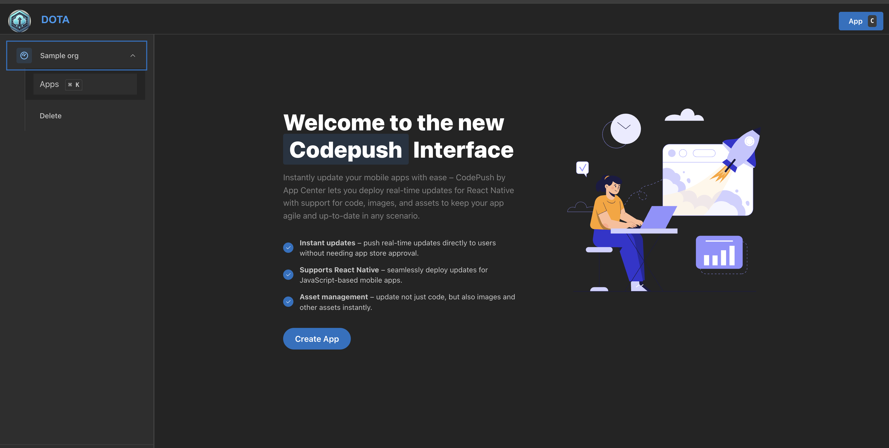
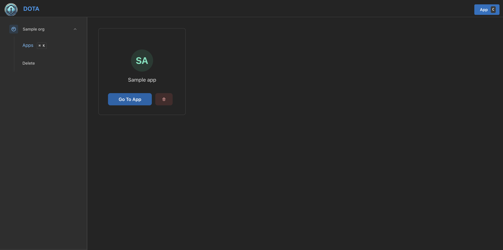
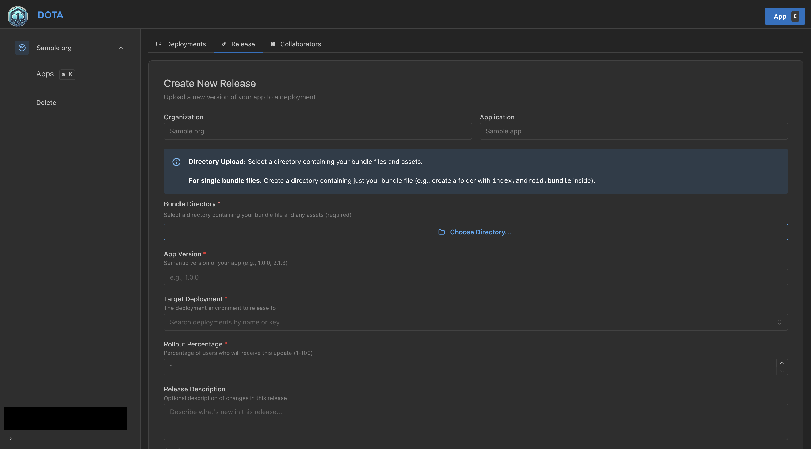
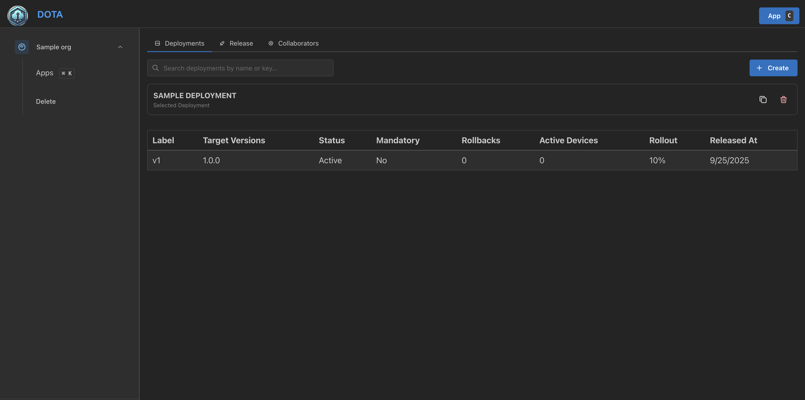
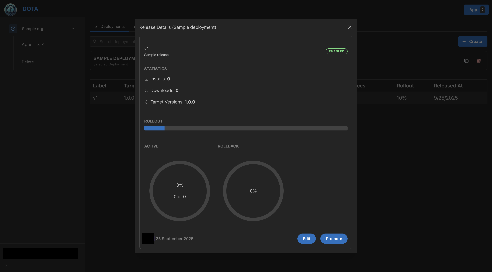

# React Native Module for CodePush
<!-- React Native Catalog -->

> ⚠️ This SDK currently supports only the React Native Old Architecture. We are working on providing support for New Architecture (Fabric/TurboModules).

* [How does it work?](#how-does-it-work)
* [Supported Components](#supported-components)
* [Getting Started](#getting-started)
    * [iOS Setup](docs/setup-ios.md)
    * [Android Setup](docs/setup-android.md)
* [Plugin Usage](#plugin-usage)
* [Creating the JavaScript bundle](#creating-the-javascript-bundle-hermes)
* [Releasing Updates](#releasing-updates)
* [Store Guideline Compliance](#store-guideline-compliance)
* [Multi-Deployment Testing](#multi-deployment-testing)
    * [Android](docs/multi-deployment-testing-android.md)
    * [iOS](docs/multi-deployment-testing-ios.md)
* [Dynamic Deployment Assignment](#dynamic-deployment-assignment)
* [API Reference](#api-reference)
    * [JavaScript API](docs/api-js.md)
    * [Objective-C API Reference (iOS)](docs/api-ios.md)
    * [Swift API Reference (iOS)](docs/api-ios-swift.md)
    * [Java API Reference (Android)](docs/api-android.md)
* [Debugging / Troubleshooting](#debugging--troubleshooting)
* [TypeScript Consumption](#typescript-consumption)

<!-- React Native Catalog -->

## How does it work?

A React Native app is composed of JavaScript files and any accompanying [images](https://reactnative.dev/docs/image), which are bundled together by the [metro bundler](https://github.com/facebook/metro) and distributed as part of a platform-specific binary (i.e. an `.ipa` or `.apk` file). Once the app is released, updating either the JavaScript code (e.g. making bug fixes, adding new features) or image assets, requires you to recompile and redistribute the entire binary, which of course, includes any review time associated with the store(s) you are publishing to.

The CodePush helps get product improvements in front of your end users instantly, by keeping your JavaScript and images synchronized with updates you release to the CodePush server. This way, your app gets the benefits of an offline mobile experience, as well as the "web-like" agility of side-loading updates as soon as they are available. It's a win-win!

In order to ensure that your end users always have a functioning version of your app, the CodePush plugin maintains a copy of the previous update, so that in the event that you accidentally push an update which includes a crash, it can automatically roll back. This way, you can rest assured that your newfound release agility won't result in users becoming blocked before you have a chance to roll back on the server. It's a win-win-win!

*Note: Any product changes which touch native code (e.g. modifying your `AppDelegate.m`/`MainActivity.java` file, adding a new plugin) cannot be distributed via CodePush, and therefore, must be updated via the appropriate store(s).*


## Supported Components

When using the React Native assets system (i.e. using the `require("./foo.png")` syntax), the following list represents the set of core components (and props) that support having their referenced images and videos updated via CodePush:

| Component                                       | Prop(s)                                  |
|-------------------------------------------------|------------------------------------------|
| `Image`                                         | `source`                                 |
| `MapView.Marker` <br />*(Requires [react-native-maps](https://github.com/lelandrichardson/react-native-maps) `>=O.3.2`)* | `image`                             |
| `ProgressViewIOS`                               | `progressImage`, `trackImage`            |
| `TabBarIOS.Item`                                | `icon`, `selectedIcon`                   |
| `ToolbarAndroid` <br />*(React Native 0.21.0+)* | `actions[].icon`, `logo`, `overflowIcon` |
| `Video`                                         | `source`                                 |

The following list represents the set of components (and props) that don't currently support their assets being updated via CodePush, due to their dependency on static images and videos (i.e. using the `{ uri: "foo" }` syntax):

| Component   | Prop(s)                                                              |
|-------------|----------------------------------------------------------------------|
| `SliderIOS` | `maximumTrackImage`, `minimumTrackImage`, `thumbImage`, `trackImage` |
| `Video`     | `source`                                                             |

As new core components are released, which support referencing assets, we'll update this list to ensure users know what exactly they can expect to update using CodePush.

*Note: CodePush only works with Video components when using `require` in the source prop. For example:*

```javascript
<Video source={require("./foo.mp4")} />
```

## Getting Started

You can start CodePush-ifying your React Native app by running the following command from within your app's root directory:

```shell
npm install --save @d11/dota
```

As with all other React Native plugins, the integration experience is different for iOS and Android, so perform the following setup steps depending on which platform(s) you are targeting. Note, if you are targeting both platforms it is recommended to create separate CodePush applications for each platform through DOTA dashboard.

Then continue with installing the native module
  * [iOS Setup](docs/setup-ios.md)
  * [Android Setup](docs/setup-android.md)

## Plugin Usage

With the CodePush plugin downloaded and linked, and your app asking CodePush where to get the right JS bundle from, the only thing left is to add the necessary code to your app to control the following policies:

1. When (and how often) to check for an update? (for example app start, in response to clicking a button in a settings page, periodically at some fixed interval)

2. When an update is available, how to present it to the end user?

The simplest way to do this is to "CodePush-ify" your app's root component. To do so, you can choose one of the following two options:

* **Option 1: Wrap your root component with the `codePush` higher-order component:**

  * For class component

    ```javascript
    import codePush from "@d11/dota";

    class MyApp extends Component {
    }

    MyApp = codePush(MyApp);
    ```

  * For functional component

    ```javascript
    import codePush from "@d11/dota";

    let MyApp: () => React$Node = () => {
    }

    MyApp = codePush(MyApp);
    ```

* **Option 2: Use the [ES7 decorator](https://github.com/wycats/javascript-decorators) syntax:**

    *NOTE: Decorators are not yet supported in Babel 6.x pending proposal update.* You may need to enable it by installing and using [babel-preset-react-native-stage-0](https://github.com/skevy/babel-preset-react-native-stage-0#babel-preset-react-native-stage-0).

  * For class component

    ```javascript
    import codePush from "@d11/dota";

    @codePush
    class MyApp extends Component {
    }
    ```

  * For functional component

    ```javascript
    import codePush from "@d11/dota";

    const MyApp: () => React$Node = () => {
    }

    export default codePush(MyApp);
    ```

By default, CodePush will check for updates on every app start. If an update is available, it will be silently downloaded, and installed the next time the app is restarted (either explicitly by the end user or by the OS), which ensures the least invasive experience for your end users. If an available update is mandatory, then it will be installed immediately, ensuring that the end user gets it as soon as possible.

If you would like your app to discover updates more quickly, you can also choose to sync up with the CodePush server every time the app resumes from the background.

* For class component

    ```javascript
    let codePushOptions = { checkFrequency: codePush.CheckFrequency.ON_APP_RESUME };

    class MyApp extends Component {
    }

    MyApp = codePush(codePushOptions)(MyApp);
    ```

* For functional component

    ```javascript
    let codePushOptions = { checkFrequency: codePush.CheckFrequency.ON_APP_RESUME };

    let MyApp: () => React$Node = () => {
    }

    MyApp = codePush(codePushOptions)(MyApp);
    ```

Alternatively, if you want fine-grained control over when the check happens (like a button press or timer interval), you can call [`CodePush.sync()`](docs/api-js.md#codepushsync) at any time with your desired `SyncOptions`, and optionally turn off CodePush's automatic checking by specifying a manual `checkFrequency`:

```javascript
let codePushOptions = { checkFrequency: codePush.CheckFrequency.MANUAL };

class MyApp extends Component {
    onButtonPress() {
        codePush.sync({
            updateDialog: true,
            installMode: codePush.InstallMode.IMMEDIATE
        });
    }

    render() {
        return (
            <View>
                <TouchableOpacity onPress={this.onButtonPress}>
                    <Text>Check for updates</Text>
                </TouchableOpacity>
            </View>
        )
    }
}

MyApp = codePush(codePushOptions)(MyApp);
```

If you would like to display an update confirmation dialog (an "active install"), configure when an available update is installed (like force an immediate restart) or customize the update experience in any other way, refer to the [`codePush()`](docs/api-js.md#codepush) API reference for information on how to tweak this default behavior.

## Creating the JavaScript bundle (Hermes)

You can use your existing bundling pipeline. Alternatively, use the scripts provided in this repo to generate optimized Hermes bundles.

#### Using the provided scripts (recommended)

Follow these steps to create bundles using the scripts in `scripts/`:

1. Copy the bundle scripts into your app

```bash
# From your React Native app root
mkdir -p scripts
```
Copy the "bundle" folder from this repo into your app's scripts directory

2. Add npm scripts to your app's package.json

```json
{
  "scripts": {
    "bundle:codepush:android": "sh scripts/bundle/bundle.codepush.sh android",
    "bundle:codepush:ios": "sh scripts/bundle/bundle.codepush.sh ios"
  }
}
```

3. Generate the bundle

Run the command for the platform you are preparing a release for:

```bash
# Android
yarn bundle:codepush:android

# iOS
yarn bundle:codepush:ios
```

Important:
- Each run starts by cleaning the `.codepush/` directory. If you run Android and then iOS consecutively, the second run will remove the first run’s outputs.
- If you need both Android and iOS bundles at the same time, either:
  - Rename or move the `.codepush/` folder after the first run (e.g., to `.codepush-android`) before running the second command, or
  - Customize the scripts to use platform-specific output paths (e.g., `.codepush/android` and `.codepush/ios`).

What you get:
- `.codepush/index.android.bundle` (Android JS bundle) and assets
- `.codepush/main.jsbundle` (iOS JS bundle) and assets
- Sourcemaps in `.codepush/` when enabled

## Releasing Updates

Once your app is configured and distributed to your users, and you have made some JS or asset changes, it's time to release them.

Release via the DOTA dashboard:
1. Navigate to the DOTA dashboard and select your organization from the sidebar.

2. Select the target app (for example, "Android Production").

3. Open the Releases tab.

4. Upload your JS bundle (see [Creating the JavaScript bundle](#creating-the-javascript-bundle-hermes)).
5. Set the target app version for this release.
6. Choose a rollout percentage.
7. Click Launch Release to publish the CodePush update.

Manage releases:
- To increase/decrease rollout or halt a release, go to the Deployments tab and select the deployment you want to manage.


If you run into any issues, check out the [troubleshooting](#debugging--troubleshooting) details below.

*NOTE: CodePush updates should be tested in modes other than Debug mode. In Debug mode, React Native app always downloads JS bundle generated by packager, so JS bundle downloaded by CodePush does not apply.*

### Store Guideline Compliance

Android Google Play and iOS App Store have corresponding guidelines that have rules you should be aware of before integrating the CodePush solution within your application.

#### Google play

Third paragraph of [Device and Network Abuse](https://support.google.com/googleplay/android-developer/answer/9888379?hl=en) topic describe that updating source code by any method other than Google Play's update mechanism is restricted. But this restriction does not apply to updating javascript bundles.
> This restriction does not apply to code that runs in a virtual machine and has limited access to Android APIs (such as JavaScript in a webview or browser).

That fully allow CodePush as it updates just JS bundles and can't update native code part.

#### App Store

Paragraph **3.3.2**, since back in 2015's [Apple Developer Program License Agreement](https://developer.apple.com/programs/ios/information/) fully allowed performing over-the-air updates of JavaScript and assets -  and in its latest version (20170605) [downloadable here](https://developer.apple.com/terms/) this ruling is even broader:

> Interpreted code may be downloaded to an Application but only so long as such code: (a) does not change the primary purpose of the Application by providing features or functionality that are inconsistent with the intended and advertised purpose of the Application as submitted to the App Store, (b) does not create a store or storefront for other code or applications, and (c) does not bypass signing, sandbox, or other security features of the OS.

CodePush allows you to follow these rules in full compliance so long as the update you push does not significantly deviate your product from its original App Store approved intent.

To further remain in compliance with Apple's guidelines we suggest that App Store-distributed apps don't enable the `updateDialog` option when calling `sync`, since in the [App Store Review Guidelines](https://developer.apple.com/app-store/review/guidelines/) it is written that:

> Apps must not force users to rate the app, review the app, download other apps, or other similar actions in order to access functionality, content, or use of the app.

This is not necessarily the case for `updateDialog`, since it won't force the user to download the new version, but at least you should be aware of that ruling if you decide to show it.

### Multi-Deployment Testing

In our [getting started](#getting-started) docs, we illustrated how to configure the CodePush plugin using a specific deployment key. However, in order to effectively test your releases, it is critical that you leverage the `Staging` and `Production` deployments that are auto-generated when you first created your CodePush app (or any custom deployments you may have created). This way, you never release an update to your end users that you haven't been able to validate yourself.

*NOTE: Our client-side rollback feature can help unblock users after installing a release that resulted in a crash, and server-side rollbacks allow you to prevent additional users from installing a bad release once it's been identified. However, it's obviously better if you can prevent an erroneous update from being broadly released in the first place.*

Taking advantage of the `Staging` and `Production` deployments allows you to achieve a workflow like the following (feel free to customize!):

1. Release a CodePush update to your `Staging` deployment using the DOTA dashboard

2. Run your staging/beta build of your app, sync the update from the server, and verify it works as expected

3. Promote the tested release from `Staging` to `Production` using the DOTA dashboard

4. Run your production/release build of your app, sync the update from the server and verify it works as expected

*NOTE: If you want to take a more cautious approach, you can even choose to perform a "staged rollout" as part of #3, which allows you to mitigate additional potential risk with the update (like did your testing in #2 touch all possible devices/conditions?) by only making the production update available to a percentage of your users. Then, after waiting for a reasonable amount of time to see if any crash reports or customer feedback comes in, you can expand it to your entire audience through DOTA dashboard.*

You'll notice that the above steps refer to a "staging build" and "production build" of your app. If your build process already generates distinct binaries per "environment", then you don't need to read any further, since swapping out CodePush deployment keys is just like handling environment-specific config for any other service your app uses (like Facebook). However, if you're looking for examples (**including demo projects**) on how to setup your build process to accommodate this, then refer to the following sections, depending on the platform(s) your app is targeting:

  * [Android](docs/multi-deployment-testing-android.md)
  * [iOS](docs/multi-deployment-testing-ios.md)


### Dynamic Deployment Assignment

The above section illustrated how you can leverage multiple CodePush deployments in order to effectively test your updates before broadly releasing them to your end users. However, since that workflow statically embeds the deployment assignment into the actual binary, a staging or production build will only ever sync updates from that deployment. In many cases, this is sufficient, since you only want your team, customers, stakeholders, etc. to sync with your pre-production releases, and therefore, only they need a build that knows how to sync with staging. However, if you want to be able to perform A/B tests, or provide early access of your app to certain users, it can prove very useful to be able to dynamically place specific users (or audiences) into specific deployments at runtime.

In order to achieve this kind of workflow, all you need to do is specify the deployment key you want the current user to syncronize with when calling the `codePush` method. When specified, this key will override the "default" one that was provided in your app's `Info.plist` (iOS) or `MainActivity.java` (Android) files. This allows you to produce a build for staging or production, that is also capable of being dynamically "redirected" as needed.

```javascript
// Imagine that "userProfile" is a prop that this component received
// which includes the deployment key that the current user should use.
codePush.sync({ deploymentKey: userProfile.CODEPUSH_KEY });
```

With that change in place, now it's just a matter of choosing how your app determines the right deployment key for the current user. In practice, there are typically two solutions for this:

1. Expose a user-visible mechanism for changing deployments at any time. For example, your settings page could have a toggle for enabling "beta" access. This model works well if you're not concerned with the privacy of your pre-production updates, and you have power users that may want to opt-in to earlier (and potentially buggy) updates at their own will (kind of like Chrome channels). However, this solution puts the decision in the hands of your users, which doesn't help you perform A/B tests transparently.

2. Annotate the server-side profile of your users with an additional piece of metadata that indicates the deployment they should sync with. By default, your app could just use the binary-embedded key, but after a user has authenticated, your server can choose to "redirect" them to a different deployment, which allows you to incrementally place certain users or groups in different deployments as needed. You could even choose to store the server-response in local storage so that it becomes the new default. How you store the key alongside your user's profiles is entirely up to your authentication solution (for example Auth0, Firebase, custom DB + REST API), but is generally pretty trivial to do.

*NOTE: If needed, you could also implement a hybrid solution that allowed your end-users to toggle between different deployments, while also allowing your server to override that decision. This way, you have a hierarchy of "deployment resolution" that ensures your app has the ability to update itself out-of-the-box, your end users can feel rewarded by getting early access to bits, but you also have the ability to run A/B tests on your users as needed.*

Since we recommend using the `Staging` deployment for pre-release testing of your updates (as explained in the previous section), it doesn't neccessarily make sense to use it for performing A/B tests on your users, as opposed to allowing early-access (as explained in option #1 above). Therefore, we recommend making full use of custom app deployments, so that you can segment your users however makes sense for your needs. For example, you could create long-term or even one-off deployments, release a variant of your app to it, and then place certain users into it in order to see how they engage.

*NOTE: The total user count that is reported in your deployment's "Install Metrics" will take into account users that have "switched" from one deployment to another. For example, if your `Production` deployment currently reports having 1 total user, but you dynamically switch that user to `Staging`, then the `Production` deployment would report 0 total users, while `Staging` would report 1 (the user that just switched). This behavior allows you to accurately track your release adoption, even in the event of using a runtime-based deployment redirection solution.*

---

## API Reference

* [JavaScript API](docs/api-js.md)
* [Objective-C API Reference (iOS)](docs/api-ios.md)
* [Swift API Reference (iOS)](docs/api-ios-swift.md)
* [Java API Reference (Android)](docs/api-android.md)

### Debugging / Troubleshooting

The `sync` method includes a lot of diagnostic logging out-of-the-box, so if you're encountering an issue when using it, the best thing to try first is examining the output logs of your app. This will tell you whether the app is configured correctly (like can the plugin find your deployment key?), if the app is able to reach the server, if an available update is being discovered, if the update is being successfully downloaded/installed, etc.

The simplest way to view these logs is to add the flag `--debug` for each command. This will output a log stream that is filtered to just CodePush messages. This makes it easy to identify issues, without needing to use a platform-specific tool, or wade through a potentially high volume of logs.


Additionally, you can also use any of the platform-specific tools to view the CodePush logs, if you are more comfortable with them. Simple start up the Chrome DevTools Console, the Xcode Console (iOS), the [OS X Console](https://en.wikipedia.org/wiki/Console_%28OS_X%29#.7E.2FLibrary.2FLogs) (iOS) and/or ADB logcat (Android), and look for messages which are prefixed with `[CodePush]`.

Note that by default, React Native logs are disabled on iOS in release builds, so if you want to view them in a release build, you need to make the following changes to your `AppDelegate.m` file:

1. Add an `#import <React/RCTLog.h>` statement. For RN < v0.40 use: `#import "RCTLog.h"`

2. Add the following statement to the top of your `application:didFinishLaunchingWithOptions` method:

    ```objective-c
    RCTSetLogThreshold(RCTLogLevelInfo);
    ```

Now you'll be able to see CodePush logs in either debug or release mode, on both iOS or Android. If examining the logs don't provide an indication of the issue, please refer to the following common issues for additional resolution ideas:

| Issue / Symptom | Possible Solution |
|-----------------|-------------------|
| Compilation Error | Double-check that your version of React Native is [compatible](#supported-react-native-platforms) with the CodePush version you are using. |
| Network timeout / hang when calling `sync` or `checkForUpdate` in the iOS Simulator | Try resetting the simulator by selecting the `Simulator -> Reset Content and Settings..` menu item, and then re-running your app. |
| Server responds with a `404` when calling `sync` or `checkForUpdate` | Double-check that the deployment key you added to your `Info.plist` (iOS), `build.gradle` (Android) or that you're passing to `sync`/`checkForUpdate`, is in fact correct. You can run `appcenter codepush deployment list <ownerName>/<appName> --displayKeys` to view the correct keys for your app deployments. |
| Update not being discovered | Double-check that the version of your running app (like `1.0.0`) matches the version you specified when releasing the update to CodePush. Additionally, make sure that you are releasing to the same deployment that your app is configured to sync with. |
| Update not being displayed after restart | If you're not calling `sync` on app start (like within `componentDidMount` of your root component), then you need to explicitly call `notifyApplicationReady` on app start, otherwise, the plugin will think your update failed and roll it back. |
| I've released an update for iOS but my Android app also shows an update and it breaks it | Be sure you have different deployment keys for each platform in order to receive updates correctly |
| I've released new update but changes are not reflected | Be sure that you are running app in modes other than Debug. In Debug mode, React Native app always downloads JS bundle generated by packager, so JS bundle downloaded by CodePush does not apply.
| No JS bundle is being found when running your app against the iOS simulator | By default, React Native doesn't generate your JS bundle when running against the simulator. Therefore, if you're using `[CodePush bundleURL]`, and targetting the iOS simulator, you may be getting a `nil` result. This issue will be fixed in RN 0.22.0, but only for release builds. You can unblock this scenario right now by making [this change](https://github.com/facebook/react-native/commit/9ae3714f4bebdd2bcab4d7fdbf23acebdc5ed2ba) locally.


### TypeScript Consumption

This module ships its `*.d.ts` file as part of its NPM package, which allows you to simply `import` it, and receive intellisense in supporting editors (like Visual Studio Code), as well as compile-time type checking if you're using TypeScript. For the most part, this behavior should just work out of the box, however, if you've specified `es6` as the value for either the `target` or `module` [compiler option](http://www.typescriptlang.org/docs/handbook/compiler-options.html) in your [`tsconfig.json`](http://www.typescriptlang.org/docs/handbook/tsconfig-json.html) file, then just make sure that you also set the `moduleResolution` option to `node`. This ensures that the TypeScript compiler will look within the `node_modules` for the type definitions of imported modules. Otherwise, you'll get an error like the following when trying to import the `@d11/dota` module: `error TS2307: Cannot find module '@d11/dota'`.

---